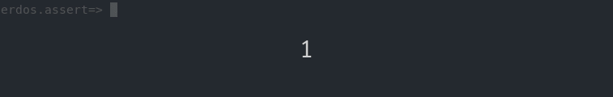
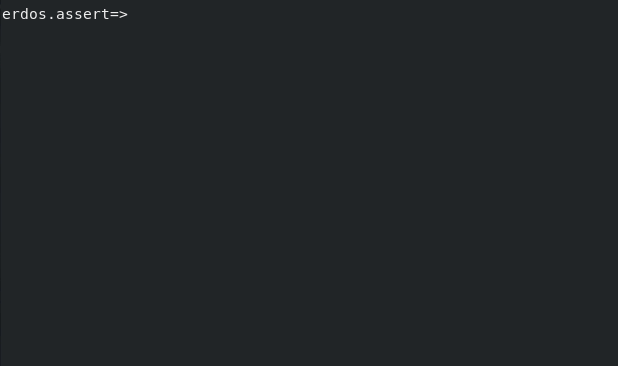

# Power Assertion macro for Clojure

The [Power Assertions](http://groovy-lang.org/testing.html#_power_assertions) feature in the Groovy language is a strong tool, it makes writing tests and finding bugs easier. This is an implementation for the Clojure programming language with support for macros and lazy sequences.

It prints subexpressions on assert failure.



And each evaluations of subexpressions are shown.



[](https://clojars.org/io.github.erdos/erdos.assert)
[](https://www.eclipse.org/legal/epl-1.0/)
[](https://github.com/erdos/erdos.assert/issues)
[](http://hits.dwyl.io/erdos/erdosassert)


## Usage

This library provides four small macros for easier debugging.
 - The `examine` macro can be used to trace parts of an evaluated expression. Debug information is printed to the standard output and the value of the expression is returned.
 - The `assert` macro is similar to `clojure.core/assert`. It wraps the examined information in the thrown `AssertionError` instance.
 - The `verify` macro is just like `assert`, but it throws an `ExceptionInfo` instead.
 - The `is` macro is a drop-in replacement for `clojure.test/is` for unit tests.

**First**, add the dependency to your `project.clj`.

```clojure
[erdos.assert "0.2.0"]
```

**Second**, require the namespace:

```clojure
(require '[erdos.assert :as ea])
```


In the REPL, **examining** simple expressions will print to `*out*`.

```clojure
erdos.assert=> (examine (* (+ 19 17) (- 19 17)))

(* (+ 19 17) (- 19 17))
¦  ¦         ¦
72 36        2
```


You can also write **assertions** that will wrap examined data as a string in the `AssertionError` instance.

```clojure
erdos.assert=> (assert (= 1 (* 3 (/ 1 3)) "") ; does not print anything

erdos.assert=> (assert (= (* 1.0 1) (* 3 (/ 1 3))) "")

; AssertionError
; (= (* 1.0 1) (* 3 (/ 1 3)))
; ¦  ¦         ¦    ¦
; ¦  1.0       1N   1/3
; false
```


Shown output is arranged to make place for more complex output.

```clojure
erdos.assert=> (examine (+ (* 12 (- 32 12) 12.2) (- 3 (/ 1 2 3 4) 2.2) (* (- 1 2) 3)))

(+ (* 12 (- 32 12) 12.2) (- 3 (/ 1 2 3 4) 2.2) (* (- 1 2) 3))
¦  ¦     ¦               ¦    ¦                ¦  ¦
¦  ¦     20              ¦    1/24             -3 -1
¦  2928.0                0.7583333333333329
2925.758333333333
```


Some expressions are evaluated repeatedly, hence all values are shown.

```clojure
erdos.assert=> (examine (dotimes [i 5] (print (* i i))))

(dotimes [i 5] (print (* i i)))
               ¦      ¦
               ¦      16, 9, 4, 1, 0
               nil, nil, nil, nil, nil
```

Only the already realized part is printed for lazy sequences.

```clojure
erdos.assert=> (examine (reduce + (map * (range) (range 0 10 2))))

(reduce + (map * (range) (range 0 10 2)))
¦         ¦      ¦       ¦
60        (…)    (0 …)   (0 2 4 6 8) 
```

In such cases you might want to run [doall](https://clojuredocs.org/clojure.core/doall) on intermediate lazy sequences.

```clojure
erdos.assert=> (examine (reduce + (doall (map * (range) (range 0 10 2)))))

(reduce + (doall (map * (range) (range 0 10 2))))
¦         ¦      ¦      ¦       ¦
60        ¦      (…)    (0 …)   (0 2 4 6 8) 
          (0 2 8 18 32) 
```

## License

Copyright © 2017-2021 Janos Erdos

Distributed under the [Eclipse Public License version 1.0](https://www.eclipse.org/legal/epl-1.0/).
